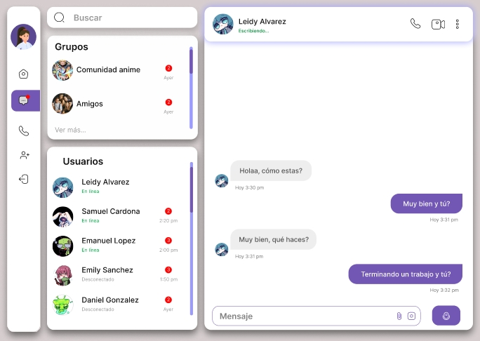
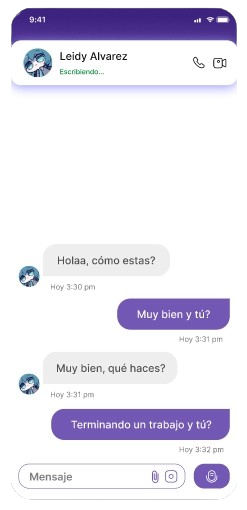
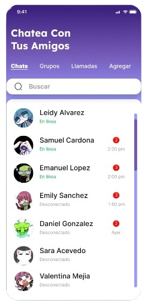
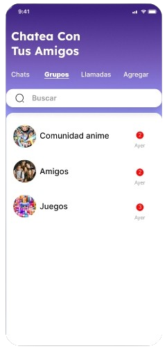

<h1>REAL-TIME-CHAT</h1>

<em>Instant Connection, Limitless Conversations, Seamless Experience</em>

<em>Built with the tools and technologies:</em>

 

## Introduction
Real-Time Chat is a scalable instant messaging application built with modern web technologies, enabling seamless communication for both individuals and groups. Once the web version is complete, the project will be extended to mobile using Kotlin.

## What are we looking for with this project?
We seek to leverage in-demand technologies by building a real-time chat platform where users can instantly send and receive messages, view other users' online statuses, and enjoy an intuitive and responsive interface.

## Features
- User registration and authentication
- Real-time message sending and receiving
- Indicator of users online and typing
- Last seen time indicator
- Unread message management
- Modern and responsive interface

## Main Technologies
This project was developed using a robust set of modern, in-demand technologies, chosen for their efficiency, scalability, and real-time capabilities:
- **React**: For building a dynamic and efficient user interface.
- **Tailwind CSS**: For utility-first, customizable, and responsive UI styling.
- **Vite**: For rapid and optimized frontend development.
- **Node.js**: Enables a scalable and efficient backend for handling real-time connections.
- **Express**: A minimalist framework for creating the backend
- **Socket.io**: Facilitates real-time communication between client and server.
- **MongoDB**: A NoSQL database for flexible storage of users and messages.

### Others :
- **ESLint**: Linting tool that helps maintain code quality, identify problematic patterns, and ensure consistent coding.
- **Mongoose**: A MongoDB object model for Node.js, providing a schema-based solution for modeling application data, making interaction with MongoDB simpler and more structured.
- **JWT (JSON Web Tokens)**: A standard for creating access tokens that enable secure user authentication within your application.
- **cookie-parser**: Parses cookies attached to client requests, used for authentication and session handling.
- **apiRoutes**: Main entry point for all backend API endpoints, organizes and handles HTTP routes.
- **Lodash**: Utility library for advanced data manipulation and functional programming helpers.
- **uuid**: Generates unique identifiers (UUIDs) for users and messages.
- **dotenv**: Loads environment variables from a .env file into process.env for configuration management.
- **npm**: Node.js package manager, used to install and manage project dependencies on both the frontend and backend.
- **JSON**: Native JavaScript object for data serialization, API responses, and configuration.
- **Markdown**: Used for project documentation and formatting in files like README.md
- **Git**: Distributed version control system for tracking changes in source code and enabling collaborative development.
- **GitHub**: Cloud-based platform for hosting Git repositories,  facilitating code sharing, collaboration, and project management.

## Project Structure Overview

### Root
- `README.md`: General project documentation.

### client/
- `package.json`, `vite.config.js`, `eslint.config.js`: Frontend configuration and dependencies.
- `index.html`: Main HTML
- `public/`: Static and public assets.
- `src/`: Frontend source code.
  - `App.jsx`, `main.jsx`, `App.css`, `index.css`: Core components and styles.
  - `assets/`: Graphic resources
  - `components/`: Reusable UI components
  - `layout/`: General layout components.
  - `pages/`: Main application pages.
  - `router/`: Navigation and routing setup.

### server/
- `package.json`: Backend dependencies and scripts.
- `app.js`, `index.js`: Server setup and entry point.
- `config/`: Database configuration.
- `middlewares/`: Custom middlewares (authentication, error handling).
- `models/`: Data models (User, Message).
- `routes/`: API route definitions.
- `services/`: Handles user authentication logic, including login and registration.
- `socket/`: Real-time communication and Socket.io events.
- `utils/`: General utilities and helpers.

---
## Design 🎨

---

## Changelog

- 18/06/2025: Last Seen Time
